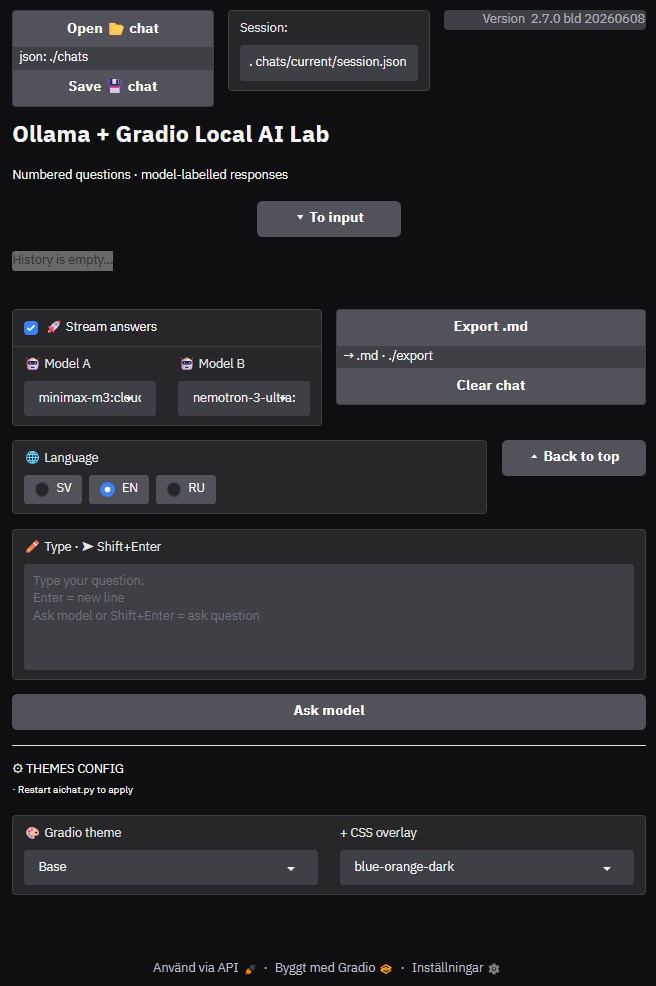

# Local AI Chat (Ollama + Gradio)

**ollama-gradio-chat** is a lightweight AI chat interface for experimenting with local and cloud-based language models.

Unlike the standard Ollama chat interface, it allows two independent models to run side-by-side in isolated A/B conversations, making it easy to compare responses, prompts, reasoning styles, and model behavior.

The application also provides chat save/load functionality using portable JSON files, allowing conversations to be archived, transferred between systems, organized manually, and restored later. This level of session management is not available in the standard Ollama client.

Additional features include a Gradio web interface, Markdown export, configurable themes, multilingual support, and persistent session storage.

It can be used as a personal AI laboratory for testing models, prompts, workflows, and long-term conversations.


## Features

* Local Ollama models
* Ollama cloud models
* A/B model comparison
* Session save and restore
* Chat save/load (.json)
* Markdown export (.md)
* Streaming and non-streaming modes
* Markdown rendering
* Syntax-highlighted code blocks
* External CSS themes
* Custom JavaScript enhancements
* Multi-language interface (EN / SV / RU)
* Persistent configuration
* Error reporting inside UI


## Quick Start

1. Install Ollama
2. Pull one or more models
3. Create virtual environment
4. Install dependencies
5. Run:

```bash
python aichat.py
```


## Installation

### 1. Install Ollama

Download:

https://ollama.com

Verify:

```bash
ollama --version
```

### 2. Install models

Example:

```bash
ollama pull nemotron-3-ultra:cloud 
ollama pull minimax-m3:cloud 
ollama pull qwen3.5:9b
ollama pull gpt-oss:20b 
```

List installed models (example):

```bash
ollama list


C:\Users\User>ollama list
NAME                          ID              SIZE      MODIFIED
nemotron-3-ultra:cloud        6d5534b63bb    -         5 days ago
minimax-m3:cloud              d03a99f45c0    -         6 days ago
cogito-2.1:671b-cloud         36c9b0682ed    -         6 weeks ago
devstral-2:123b-cloud         d37acab6a27    -         6 weeks ago
gemma4:31b-cloud              c382fbbc73b    -         6 weeks ago
qwen3-coder-next:cloud        aa626c1ae8d    -         2 months ago
qwen3.5:397b-cloud            a7bf6f891c3    -         2 months ago
gpt-oss:120b-cloud            56966227105    -         2 months ago
mistral-large-3:675b-cloud    3130fda5a1e    -         2 months ago
minimax-m2.7:cloud            06daa29c105    -         2 months ago
devstral-small-2:24b          24277f0f62d    15 GB     2 months ago
gpt-oss:20b                   17052f9142e    13 GB     2 months ago
qwen3.5:9b                    648c96fa5fa    6.6 GB    2 months ago
ministral-3:14b               4760c5aeb9d    9.1 GB    2 months ago
cogito:14b                    d0cc86a2347    9.0 GB    11 months ago
```

### Clone repository

```bash
git clone https://github.com/Soviet9773Red/ollama-gradio-chat.git
cd ollama-gradio-chat
```

### 3. Create virtual environment

```bash
python -m venv .venv
```

Activate:

```bash
# Windows
.venv\Scripts\activate

# Linux / macOS
source .venv/bin/activate
```

### 4. Install dependencies

```bash
pip install -r req.txt
```

## Running the Application

Start:

```bash
python aichat.py
```

Typical local address:

```text
http://127.0.0.1:7860
```

LAN access:

```text
http://YOUR_LOCAL_IP:7860
```


## System Requirements

### Local Models

Requirements depend on model size.

| Component | Recommended             |
| --------- | ----------------------- |
| CPU       | Intel i5-8400 or better |
| RAM       | 16 GB minimum           |
| RAM       | 32 GB+ recommended      |
| GPU       | GTX 1660 6 GB or better |
| OS        | Windows / Linux / macOS |

Notes:

* CPU-only operation is supported.
* Larger models require more RAM and VRAM.
* GPU acceleration significantly improves performance.

### Cloud Models

When using cloud-hosted models, hardware requirements are much lower.

| Component | Recommended              |
| --------- | ------------------------ |
| CPU       | Any modern dual-core CPU |
| RAM       | 4-8 GB                   |
| GPU       | Not required             |
| OS        | Windows / Linux / macOS  |

Notes:

* Model inference runs remotely.
* Local hardware mainly renders the web interface.
* Internet connection quality becomes more important than GPU performance.


## Project Structure

The project structure is documented separately: [Project Structure](project-structure.md)


## Main Components

### aichat.py

Main application:

* Gradio interface
* Ollama integration
* Model comparison
* Session handling
* Theme management

### config.json

Persistent user settings.

### chats/

Stored chat sessions.

### exports/

Markdown exports.

### sys/

UI resources:

* CSS
* JavaScript
* Themes


## Supported Languages

* English
* Svenska
* Русский


## Use Cases

* Local LLM experimentation
* Prompt testing
* A/B model comparison
* Multilingual interaction
* Code generation
* Model evaluation


## GUI example

The screenshot below shows the main interface with model selection, session management, theme controls, and A/B comparison mode.



## Version

Current version:

```text
2.7.0
```

See: [changelog.md](hangelog.md) for release history.


## License

MIT License

(c) Alexander Soviet9773Red
